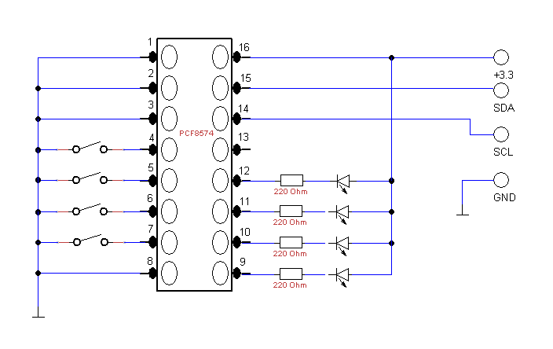

Raspberry_PCF8574
=================

Few examples of Raspberry Pi controls '''PCF8574''', Remote 8-bit I/O expander for I2C-bus with Python

==pcf8574_read_write.py==

This example shows how to read and write to PCF8574 I/O expander, and lights up a LED when button is pressed.

Video avaible here: http://youtu.be/Xsl87MCWHjI

==pcf8574_led_rotate.py==

This example shows how to rotate lighted up LED to achive wandering light effect. 
Light speeds up when any button is pressed

Video avaible here: http://youtu.be/TQgOD2pfIVY
